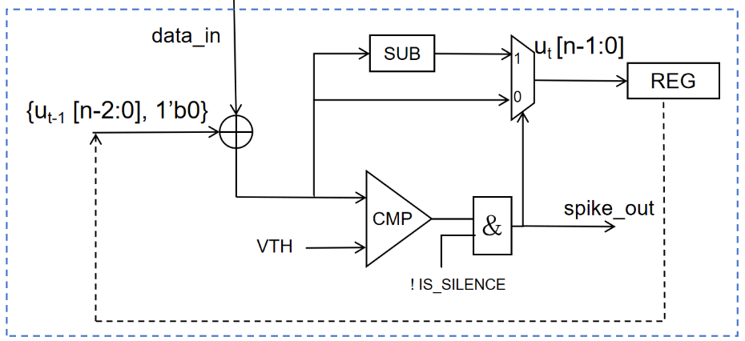

### Reference TSA Implemention in Hardware

In the figure above, we illustrate each component from left to right:  
- The leftmost part is the _adder_, which takes the shifted membrane potential and the current input as inputs.  
- The _comparator_ checks whether the absolute value of the updated membrane potential exceeds the positive spike threshold.  
- The _spike generation_ is determined by the comparison result and the silent period control signal.  
- The _shift operation_ is implemented purely through wiring, represented by dashed arrows pointing from the register to the input.
